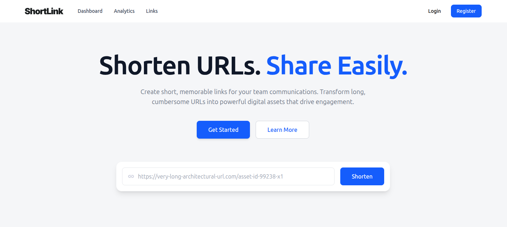
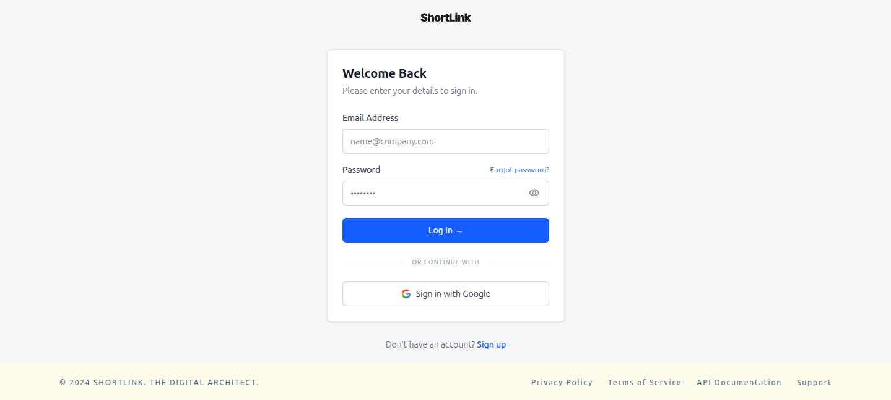
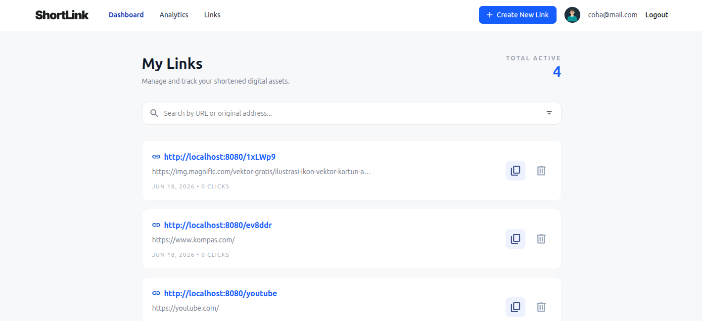

# Shortlink Frontend

[](https://opensource.org/license/mit)
[](https://react.dev/)
[](https://vitejs.dev/)
[](https://tailwindcss.com/)
[](https://www.docker.com/)

Frontend application for the Shortlink platform built using React, Vite, and Tailwind CSS.

---

## Project Description

Shortlink Frontend is a modern web application that allows users to manage shortened URLs through an intuitive and responsive interface.

Users can:

- Register a new account
- Login securely
- Create shortened URLs
- View dashboard statistics
- Manage existing links
- Track link analytics
- Copy and share generated short links

The frontend communicates with the Shortlink Backend REST API and provides a seamless user experience for URL management.

---

## Preview

### Landing Page



### Login Page



### Dashboard



---

## Technology Stack

### Frontend

- React
- Vite
- Tailwind CSS
- React Router DOM
- Fetch API

### Deployment

- Docker
- Nginx

---

## Features

### Authentication

- User Registration
- User Login
- JWT Authentication
- Protected Routes

### Dashboard

- View total links
- View total clicks
- Quick access to link statistics

### Link Management

- Create short URLs
- Copy short URLs
- Delete URLs
- View URL details

### Analytics

- View click statistics
- Monitor link performance

### User Experience

- Responsive Design
- Modern UI
- Fast Navigation
- Error Handling & Validation

---

## Project Structure

```text
shortlink-frontend/
│
├── public/
│
├── src/
│   ├── AppRouter.jsx
│   ├── globals.css
│   ├── main.jsx
│   ├── assets/
│   ├── components/
│   ├── context/
│   ├── pages/
│   ├── services/
│   └── utils/
│
├── Dockerfile
├── nginx.conf
├── package.json
└── README.md
```

---

# Setup

## 1. Clone Repository

```bash
git clone https://github.com/BernadDwiki/shortlink-frontend.git
cd shortlink-frontend
```

---

## 2. Environment Configuration

Create a `.env` file in the project root:

```env
VITE_API_URL=http://localhost:8080
```

### Environment Variables

| Variable | Description |
|-----------|-------------|
| VITE_API_URL | Backend API Base URL |

Example:

```env
VITE_API_URL=http://localhost:8080
```

---

## 3. Install Dependencies

```bash
npm install
```

---

## 4. Run Development Server

```bash
npm run dev
```

Application will be available at:

```text
http://localhost:5173
```

---

## 5. Production Build

Generate production build:

```bash
npm run build
```

Build files will be generated inside:

```text
dist/
```

Preview production build locally:

```bash
npm run preview
```

---

## Backend Integration

The frontend requires the Shortlink Backend API to be running.

Default backend URL:

```text
http://localhost:8080
```

Configured via:

```env
VITE_API_URL=http://localhost:8080
```

Make sure the backend server is running before using the application.

---

# Docker Setup

## Build Docker Image

```bash
docker build -t shortlink-frontend:local .
```

---

## Run Docker Container

```bash
docker run -p 3000:80 shortlink-frontend:local
```

Frontend will be available at:

```text
http://localhost:3000
```

---

# Docker Compose

The project supports running the complete stack using Docker Compose.

From the backend project directory:

```bash
docker compose up --build
```

This will automatically:

- Start PostgreSQL
- Build and run Backend
- Build and run Frontend

Default ports:

| Service | Port |
|----------|------|
| Frontend | 3000 |
| Backend | 8080 |
| PostgreSQL | 5432 |

---

# Application Pages

| Page | Description |
|--------|-------------|
| Landing Page | Homepage of the application |
| Login Page | User authentication |
| Register Page | User registration |
| Dashboard Page | Overview of links and clicks |
| Analytics Page | Link analytics and statistics |
| Create Link Page | Create new short URLs |
| Profile Page | User profile management |

---

# Design Decisions

### React + Vite

Chosen because:

- Fast development experience
- Lightweight configuration
- Excellent performance
- Modern frontend tooling

### Tailwind CSS

Chosen because:

- Utility-first approach
- Rapid UI development
- Consistent styling
- Easy customization

### Context API

Used for:

- Authentication state management
- Sharing user session across pages
- Avoiding prop drilling

### Docker + Nginx

Used because:

- Consistent deployment environment
- Easy containerization
- Optimized static file serving

---

# Future Improvements

- Dark Mode
- Custom URL Alias
- QR Code Generator
- Advanced Analytics Dashboard
- User Settings Page
- Link Expiration Management

---

# Related Project

Frontend is designed to work with:

Backend Repository:
https://github.com/BernadDwiki/shortlink-backend

---

# License

This project is licensed under the MIT License.